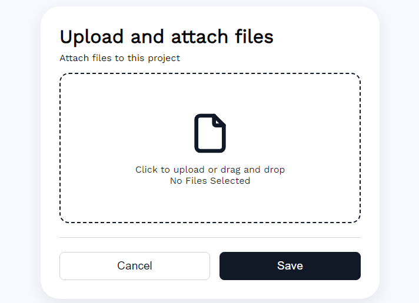
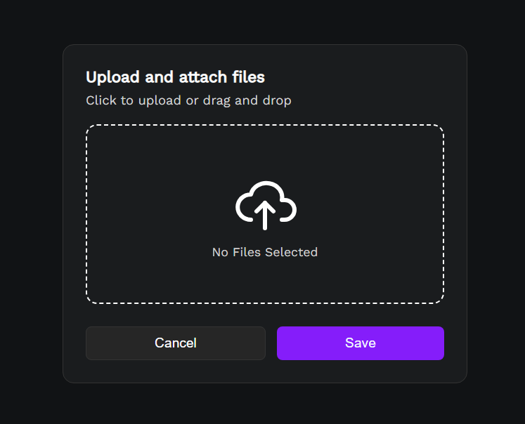
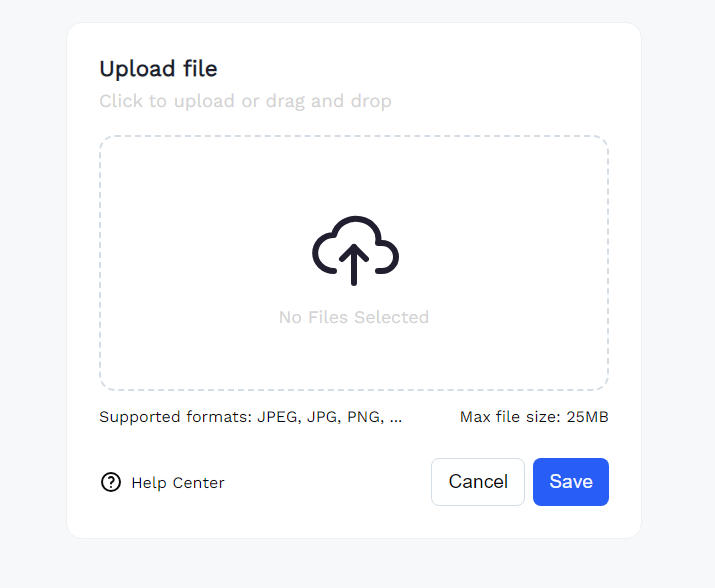
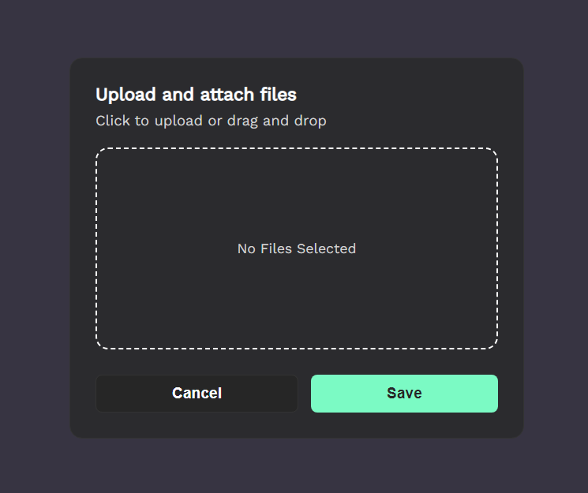

# 💻 Plantillas para carga de archivos HTML, JS and CSS

Bienvenido a la **File-Upload **

## 💻Descripcion

Este sistema esta desarrollado utilizando las siguientes tecnolog铆as:
- **Version AppWeb**: V 1.0.0
- **Fecha**: Octubre 16, 2024
- **Lenguaje de programaci贸n**: HTML, JS, CSS

## 💻Contacto

Si estas interesado en adquirir el sistema o tienes alguna pregunta, no dudes en contactarme:

- **Derechos de autor**: Copyright 2024 Carlos Pc´s Soluciones / All rights reserved
- **Desarrollador Web y Lider de Proyecto**: Carlos Flores
- **WhatsApp**: +584123330319
- **Email**: cflores@carlospcssoluciones.com.ve
- **Github**: https://github.com/encrypthdd/file-upload.git

# 💻 Funcionalidades

### 💻  Panel de Control

### file-upload-01

### file-upload-02

### file-upload-03

### file-upload-04

